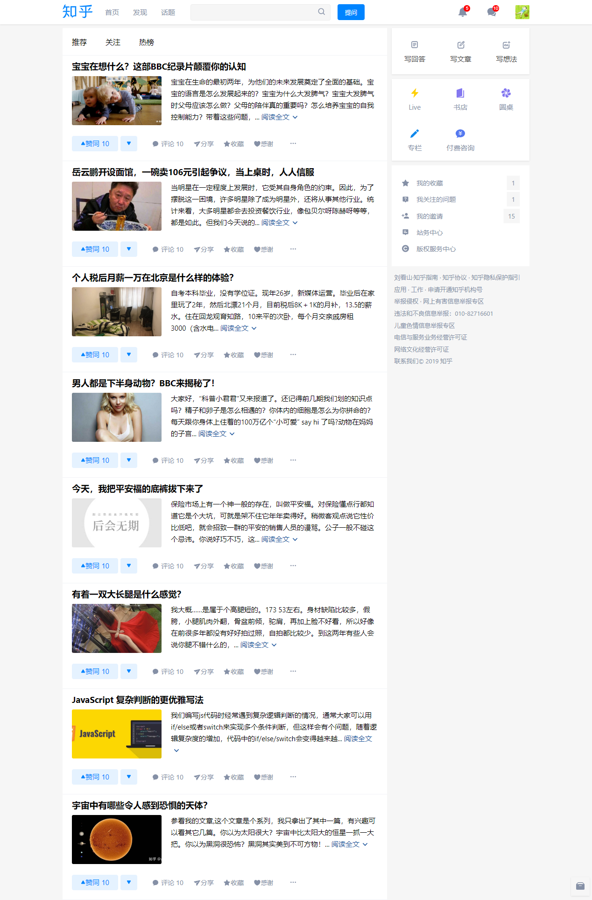

# ABOUT

## Before you start

This is a project writing with **React** for the purpose of practice.  

The project imitates [**ZhiHu** homepage](https://www.zhihu.com/). Most of the sections, images and SVG icons are copied from ZhiHu and it's users' posts, but no users' info is reveled, I put mine on the page instead.  

The project is built based on *create-react-app*.  

All styles are imported using *CSS Module*.

For practice purpose, I wrote a simple server using *express* named "express_server.js".  

I didn't work on the compatibility because I don't know how yet. As I tested, the page works fine in both Chrome and Firefox. But in Edge, the corner button wont move up.

This is my first "real" project and I'm far from experienced, so the code can be ugly and so does the file structure, which I reformed many times.

## How to start

First of all, **node.js** is needed of course :)

One way to run:
```
git clone https://github.com/Planisplan/zhihu_homepage.git
cd zhihu_homepage
npm install
npm start    //visit localhost:3000
```
This way doesn't use the express server, data comes from local file name "souces.js"

Another way to run:
```
git clone https://github.com/Planisplan/zhihu_homepage.git
cd zhihu_homepage
npm instal
npm run build
node express_server.js  //visit localhost:4000
```
This way runs with express server and data is required with *fetch api*

If nothing goes wrong, the page should be like this:



## Outline

- public (static folder, all the images are in it)
- src
  - index.js (entry)
  - sources.js (data)
  - App.js (scroll events)
  - header (the header component)
    - index.js
    - notification
    - search bar
    - message panel (click to pop out)
    - news panel (click to pop out)
    - user panel (click to pop out)
  - main (main content area)
    - index.js
    - featured contents
    - followed posts
    - hot posts
    - nav bar
  - aside (sidebar component)
    - index.js
    - top section
    - middle section
    - bottom section
    - many links
- express_server.js
- sources_express.js (data sent by server)